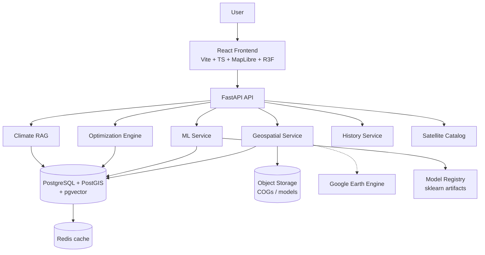

# UrbanFlux — Urban Heat Intelligence Platform

**Predict. Simulate. Optimize. Cool.**

UrbanFlux is a geospatial AI platform that identifies urban heat hotspots anywhere on Earth, explains the drivers behind them, simulates cooling interventions, and optimizes where those interventions should be deployed — with every result traceable to its satellite, sensor, dataset, model version, and scientific evidence.

> **Scientific integrity note** — In this repository state the analysis workspace ships with a synthetic demonstration dataset for Delhi. Every number produced from it is labelled **DEMO SCENARIO** in the UI and API. The pipeline, models, scenario engine and optimizer are real code paths; Earth Engine ingestion, global model training and RAG generation are implemented behind documented adapters and activate when configured (see §Earth Engine configuration). The system is built so mock data can never silently pose as science: every response carries `scenario_type: "DEMO" | "REAL"` and the UI renders distinct badges for **OBSERVED / PREDICTED / SIMULATED / DEMO**.

## Problem

Static heat maps answer only *where is it hot*. Urban planners need *why*, *what can change it*, *where*, *how much*, *at what cost*, and *who benefits*. UrbanFlux converts satellite, meteorological, and urban-morphology data into actionable, evidence-linked cooling decisions.

## Solution

| Capability | Implementation |
| --- | --- |
| Heat hotspots | Landsat-class LST → adaptive percentile + spatial clustering classification into COOL / MODERATE / HOT / EXTREME |
| Driver analysis | Model-agnostic feature attribution surfaced per hotspot with climate-appropriate caveats |
| Scenario simulation | Documented first-order energy-balance response model (§Physics-informed methodology) |
| Optimization | Real NSGA-II (pymoo) multi-objective Pareto optimization over real cells |
| Mitigation intelligence | Retrieval-augmented generation over a curated corpus of real urban-climate literature with evidence grades; the LLM proposes, the scenario model estimates, the optimizer allocates |
| Global reach | Every analysis is anchored to an AOI; Delhi is the default demonstration location, not a hard-coded assumption |

## Architecture



## Features

- **Global location explorer** — search the planet (Nominatim/MapTiler abstraction), draw rectangles/polygons/radii, upload GeoJSON; any land AOI can enter the pipeline.
- **AOI workspace** — nested routes: overview, heat, history, layers, drivers, model, scenario, optimize, solutions, report.
- **Heat map explorer** — MapLibre with LST, heat risk, NDVI, NDBI, NDWI, buildings, population, interventions layers; per-cell pixel inspector with full provenance.
- **Historical Earth timeline** — mission-era markers (Landsat 1972→, MODIS 1999/2002→, VIIRS 2011→, Sentinel-2 2015→, Sentinel-3 2016→, ECOSTRESS 2018→), year/month/day scrubbing, seasonally-matched A/B compare, change detection.
- **Scenario Lab** — tree canopy, cool roofs, green roofs, albedo, water area; baseline vs simulated vs delta with population and cost.
- **Optimization Engine** — NSGA-II over real AOI cells with objectives: cooling ↑, population benefit ↑, heat-risk reduction ↑, cost ↓, difficulty ↓, feasibility ↑; interactive Pareto frontier.
- **UrbanFlux Climate RAG** — BM25 + dense vector hybrid retrieval, metadata filtering (climate zone, region, intervention, evidence grade), reranking, per-claim citations with DOIs; refuses with `INSUFFICIENT EVIDENCE` when retrieval is weak.
- **SHAP explainability** — exact tree SHAP served from the trained registry artifact: per-hotspot warming/cooling factors with SHAP values, base value, and predicted LST; `explanation_method` + `model_version` always exposed.
- **Live Earth Engine path** — set `DEMO_MODE=false`, `DATA_MODE=live`, `GEE_PROJECT_ID` and the same routes serve a real Landsat 8/9 C2 L2 surface-temperature grid (S2 indices, GHSL population, ERA5 context), cached per AOI/window, with scene metadata provenance; without credentials the API refuses with `LIVE_DATA_NOT_CONFIGURED` rather than substituting demo data.
- **Custom 404 / 500 / data-unavailable** states in the UrbanFlux visual language.
- **Demo mode** — full frontend experience without a backend via `VITE_DEMO_MODE=true`.

## Datasets

| Mission | Platform | Sensor | Variables | Earliest | Provider |
| --- | --- | --- | --- | --- | --- |
| Landsat 4/5/7/8/9 | respective | OLI / OLI-2 / TIRS / TIRS-2 / TM / ETM+ | LST, reflectance, indices | 1982 (C2 ST) | USGS / NASA |
| Sentinel-2 | S2A/S2B/S2C | MSI | NDVI, NDWI, NDBI, reflectance | 2015 | Copernicus / ESA |
| Sentinel-3 | S3A/S3B | SLSTR | LST | 2016 | Copernicus / ESA |
| Terra / Aqua | — | MODIS | LST, emissivity, vegetation | 1999 / 2002 | NASA |
| Suomi NPP / NOAA-20/21 | — | VIIRS | LST, nighttime | 2011 | NASA / NOAA |
| ECOSTRESS | **ISS** (not a satellite) | thermal radiometer | high-res LST | 2018 | NASA / JPL |
| ERA5 | — | reanalysis | 2 m temp, humidity, wind, radiation | 1940 | ECMWF / C3S |
| OSM / GHSL | — | vector / raster | buildings, roads, green, population | — | OSM / EC JRC |

## Technology

**Backend** Python · FastAPI · Pydantic v2 · SQLAlchemy · GeoAlchemy2 · GeoPandas · Rasterio · Shapely · NumPy · Pandas · scikit-learn · XGBoost · SHAP · pymoo · Earth Engine API (optional) · pytest.

**Frontend** React 19 · TypeScript · Vite · Tailwind CSS 4 · GSAP + ScrollTrigger · Framer Motion · React Three Fiber + Drei (lazy) · MapLibre GL · Lenis · Recharts · TanStack Query v5 · Zustand · Lucide.

## ML Pipeline


The trainable reference model (scikit-learn HistGradientBoosting with physics plausibility checks) lives in `backend/app/ml/training/train_model.py`; the documented path to the full global multi-model pipeline (PyTorch physics-informed branch, SHAP service, XGBoost/LightGBM comparison) is `docs/ml-methodology.md`.

## Physics-informed methodology

Scenario deltas are computed with a **documented first-order surface energy-balance heuristic**, *not* fitted coefficients: tree canopy and green roofs raise latent-heat partitioning (evaporative cooling, moisture-limited in arid zones via a documented aridity factor); albedo changes reduce absorbed shortwave (`ΔRn = -Δα · S_down`); water bodies add evaporative cooling with distance-decayed advection. Radiative terms use physically derived expressions (Stefan–Boltzmann inversion for emissivity effects, documented ε = 0.97 for vegetation); coefficients are literature-motivated, normalized, and labelled as heuristics — never presented as validated local physics. Full assumptions: `docs/physics-informed-ai.md`.

## Scenario simulation

`POST /api/v1/scenarios` → cell-level canopy/albedo/water deltas → energy-balance response → simulated LST grid, summary (mean/min/max ΔLST, population benefited, cost estimate), hotspot reclassification. All outputs flagged `scenario_type: DEMO` when computed on the demo dataset.

## Optimization

`POST /api/v1/optimization` builds a real NSGA-II problem (pymoo) over the demo cells with six objectives and per-cell budget, capacity, and canopy constraints. Returns a genuine Pareto front of ≥40 solutions, each traceable to its decision vector and selectable on the map. Feasibility/recommendation layers are derived from the same front — no hard-coded solutions.

## Installation

```bash
git clone https://github.com/your-org/urbanflux && cd urbanflux

# Docker (full stack)
cp .env.example .env
docker compose up

# Backend (local)
cd backend && python -m venv .venv && .venv/bin/pip install -r requirements.txt
.venv/bin/uvicorn app.main:app --reload

# Frontend (local)
cd frontend && npm install && npm run dev
```

## Earth Engine configuration

1. Create a GCP project, enable the Earth Engine API, register a service account.
2. `GOOGLE_APPLICATION_CREDENTIALS=/path/to/key.json`, `GEE_PROJECT_ID=…`, `DATA_MODE=live`.
3. `services/earth_engine/` activates; with GEE unconfigured the demo dataset is served with explicit DEMO flags.
4. Ingestion: Landsat Collection 2 Level-2 ST (L9/C2 L2), Sentinel-2 L2A, ERA5 via `ee.ImageCollection` with cloud masking (`QA_PIXEL`), CRS normalization to EPSG:4326, resampling to the AOI analysis grid.

## Environment variables

See `.env.example`. Key flags: `DATA_MODE` (live/cached/test), `DEMO_MODE` (backend demo dataset), `VITE_DEMO_MODE`, `VITE_API_URL`, `MAP_STYLE_URL`, `DATABASE_URL`, `REDIS_URL`, `GEE_PROJECT_ID`, `GOOGLE_APPLICATION_CREDENTIALS`.

## Docker

`docker-compose.yml` provides frontend, backend, worker, postgres-postgis (with pgvector), and redis. `docker compose up --build` — the stack is production-shaped but ships without real satellite processing configured; connect Earth Engine credentials before treating outputs as observational.

## Development

```bash
cd backend && pytest -q                 # 45 tests (incl. persistence)
cd backend && ruff check app && black --check app
cd frontend && npm run lint && npm test && npm run build
```

### Typed API contract

Frontend payload types are **generated from the backend OpenAPI schema**, so shapes cannot drift:

```bash
# After changing backend schemas/routes, regenerate the contract:
cd backend && python -c "import json; from app.main import app; json.dump(app.openapi(), open('../frontend/openapi.json','w'), indent=2)"
cd ../frontend && npm run openapi
```

`frontend/openapi.json` is committed; CI diffs a freshly-dumped schema against it and fails on drift. Annotated routes live in `backend/app/schemas.py` (`Envelope[T]`, response models with `extra="allow"` — annotation can never strip payload fields).

### Persistence

AOIs and scenarios are stored via SQLAlchemy (`app/db/`): SQLite by default (`urbanflux.db`, zero setup), PostgreSQL via `DATABASE_URL` (as in docker-compose). State survives backend restarts; if the database is unavailable, routes degrade to transient in-memory behavior rather than failing.

## API docs

Swagger UI: `http://localhost:8000/docs` · ReDoc: `/redoc` · OpenAPI JSON: `/openapi.json` — all routes versioned under `/api/v1/` with the standard `{success, data, meta, error}` envelope.

## Frontend demo mode

`VITE_DEMO_MODE=true` (default in `.env.example`) routes every data call through `src/services/api/demo/mockBackend.ts`, which implements the full API surface in-memory. Components are adapter-agnostic; switching to the real backend is a one-env-var change with zero component redesign.

## Testing

Backend: pytest suite covering API contract, demo data integrity, scenario engine physics, optimizer determinism, RAG retrieval, history, and provenance enforcement. Frontend: Vitest + React Testing Library (landing renders, WebGL-disc fallback, workspace shell, 404 route) plus a Playwright config for the core user flow (search → AOI → map → hotspot → scenario).

## Deployment

- Container images per service (`docker/`), compose for orchestration; frontend served as static build (nginx / CDN).
- No secrets in repo; `.env.example` documents every variable.
- CI (`.github/workflows/ci.yml`): frontend lint/test/build, backend lint/test, docker build — never auto-deploys unconfigured secrets.

## Limitations

- **Demo data**: the bundled Delhi grid is synthetic; no scientific claim is made from it, and outputs are labelled DEMO SCENARIO everywhere.
- **GEE ingestion, global training, RAG LLM generation** are adapter-gated and require credentials/model artifacts to activate; until then they serve explicit placeholders or refuse (INSUFFICIENT DATA / INSUFFICIENT EVIDENCE).
- Single AOI analysis at a time in the MVP; no auth (admin/researcher/planner/viewer roles architected for later).
- Buildings come from OSM via GeoJSON; no 3D morphology or mean radiant temperature modeling yet.

## Scientific assumptions

- Scenario deltas use documented, normalized energy-balance heuristics — directional and relative, not calibrated local predictions.
- Hotspot thresholds are adaptive percentiles by default (configurable to fixed, Getis-Ord, DBSCAN).
- Native sensor resolution is always displayed; coarse products are never upsampled and presented as high-resolution observation.
- SHAP-style attributions are phrased as *model-associated factors*, never causal claims.
- Vegetation emissivity ε = 0.97 and cloud masking via QA_PIXEL are the only fixed physics constants, both documented.

##
© 2026 UrbanFlux. Built for urban climate decision-making.
