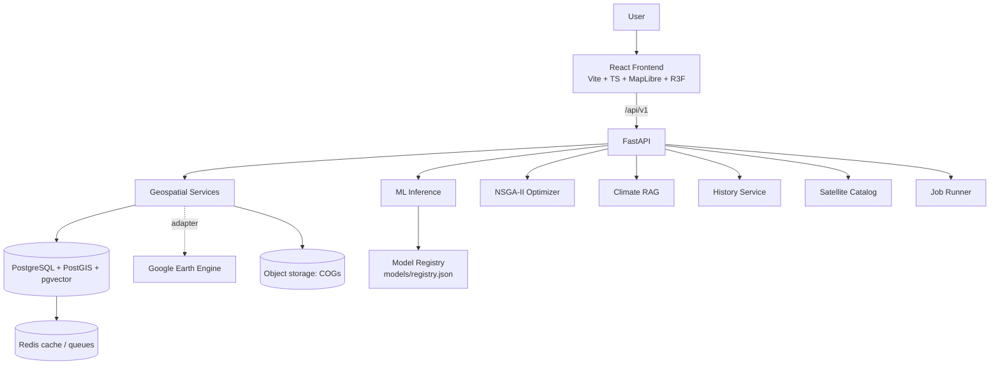
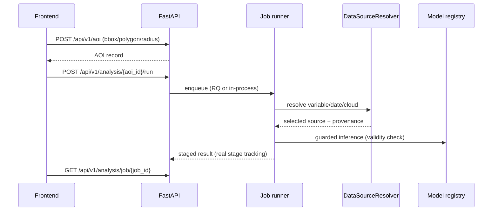

# Architecture

## System overview

## Layered structure

| Layer | Responsibility | Key modules |
| --- | --- | --- |
| API | Envelope-wrapped REST, validation, rate limiting | `app/api/routes/*` |
| Services | Domain logic, no HTTP concerns | `app/services/*` |
| ML | Training, registry, guarded inference | `app/ml/`, `app/services/ml/` |
| Core | Config, logging, envelope, security | `app/core/*` |

## Request flow (analysis)

## Adapter boundaries

- **Earth Engine** (`earth_engine_service.py`) — real `ee` calls; raises `EarthEngineUnavailableError` without credentials. Callers fall back to the demo dataset **with DEMO flags**, never silently.
- **Geocoding** (frontend `services/geocoding/`) — Nominatim default, MapTiler behind the same provider interface.
- **Vector retrieval** (`services/rag/embeddings.py`) — pgvector/Qdrant gated; BM25 leg always honest about which legs ran.
- **LLM generation** — optional; the deterministic citation-locked composer is the default.

## Scientific separation

OBSERVATION ≠ MODEL ≠ SIMULATION ≠ GENERATIVE AI is enforced structurally:
`ObservationProvenance` travels with every raster/prediction; outputs carry
`scenario_type: DEMO | REAL`; the frontend renders distinct badges.
