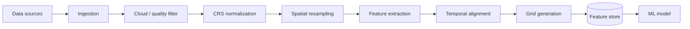

# Geospatial Pipeline

## Workflow

## Analysis grid

Every dataset is projected onto a shared AOI grid (`analysis_cells`):

- Cell size chosen by **AUTO RESOLUTION** (`GET /api/v1/explorer/auto-resolution`):
  AOI area + limiting source decide (≤25 km² → 30 m, ≤400 → 100 m,
  ≤10⁴ km² → 1 km, else 10 km).
- The **limiting source** (e.g. Landsat Surface Temperature) is displayed with
  the grid; coarse products are never upsampled and passed off as high-res.
- Each cell stores: `lst, ndvi, ndbi, ndwi, albedo, building_density,
  road_density, green_fraction, water_distance, air_temperature, humidity,
  wind_speed, solar_radiation, population, heat_risk, prediction`.

## Resolution integrity

- `native_resolution_meters` travels in every `ObservationProvenance`.
- Display grids may render smoother than native (browser interpolation), but
  every UI surface labels **NATIVE DATA RESOLUTION**.
- Fusion products (Landsat spatial + MODIS temporal) are labelled
  **MODEL-ESTIMATED**, never OBSERVED.

## Cloud/quality filtering

- Landsat: `QA_PIXEL` bit 3 (cloud), bit 4 (cloud shadow), bit 5 (snow).
- Sentinel-2: `SCL` classes 3 (cloud shadow), 8/9 (clouds), 10 (cirrus).
- Rejection thresholds configurable per request (`max_cloud`), default 20%,
  timeline filter offers <5% / <10% / <20%.

## Temporal alignment

- Scenario/history comparisons default to **season-matched** windows
  (`POST /history/{aoi_id}/compare` refuses to present a January-vs-June
  delta without an explicit season-mismatch warning).
- Composites: median over the requested window after masking.

## Caching

Analysis results cache on `hash(AOI, date, dataset_version, feature_version,
model_version)` so identical requests never recompute (spec §179).
The live grid additionally caches the full extraction in-process per
`cache_key(bbox, start, end)`; repeat requests hit the cache, not Earth Engine.

## Live provider (Earth Engine — implemented)

`app/services/grid/` implements the provider switch used by every route:

| Provider | When | Behavior |
| --- | --- | --- |
| `DEMO` | `DEMO_MODE=true` (default) | labelled synthetic grid |
| `LIVE` | `DEMO_MODE=false` + `DATA_MODE=live` + `GEE_PROJECT_ID` | real extraction, cached |
| `UNAVAILABLE` | live requested, credentials missing | **HTTP 503 `LIVE_DATA_NOT_CONFIGURED`** — never demo-substituted |

Live extraction (`grid/live_extraction.py`):

1. Landsat 8/9 C2 L2 → `ST_B10 × 0.00341802 + 149 − 273.15` °C, `QA_PIXEL`
   bits 3/4/5 masked, clearest scene in the window (cloud < 25%).
2. Sentinel-2 L2A median composite → NDVI / NDBI / NDWI + broadband albedo
   proxy; `SCL` 3/8/9/10 masked.
3. GHSL `GHS_POP` → residents per cell.
4. Combined `sampleRegions` over the 40×40 cell-center grid (single request).
5. ERA5 monthly → AOI-center T2M / wind / radiation context.
6. Scene provenance (spacecraft, sensor, scene id, cloud cover, acquisition
   date) read from the **selected scene's metadata** — never hard-coded.

Tests exercise this path end-to-end with a fake `ee` module
(`tests/test_grid_live.py`): contract shape, REAL flagging, provenance
propagation, and the refusal path.
