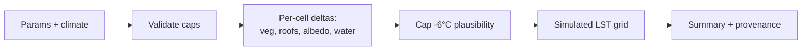

# Scenario Engine

## Purpose

Estimate how an AOI's surface temperature responds to cooling interventions —
through an abstraction that today runs on the demo grid and tomorrow runs on
real Earth Engine features with a trained model. The interface never changes;
the provenance does.

## Parameters

| Parameter | Range | Meaning |
| --- | --- | --- |
| `tree_canopy_percent` | 0–50 | canopy uplift applied across eligible cells |
| `cool_roof_percent` | 0–100 | share of eligible roofs converted to high-albedo |
| `green_roof_percent` | 0–100 | share converted to extensive green roofs |
| `albedo_delta` | 0–0.45 | pavement/surface albedo uplift |
| `water_area_delta` | 0–10% | new water surface share (oasis effect) |
| `climate` | key | sets moisture factor `f_w` |
| `target_zone` | optional | spatial restriction (roadmap) |
| `budget` | optional | constraint surfaced to the optimizer |

**Hard constraint:** `cool_roof_percent + green_roof_percent ≤ 100` (HTTP 400
`INVALID_SCENARIO` otherwise).

## Computation flow



## Results

- `simulated_lst[1600]`, `delta_lst[1600]` — cell-level grids.
- Summary: `mean/max delta`, simulated min/max, `population_benefited`
  (cells with ΔLST < −0.15 °C weighted by population), hotspot count before/after,
  `estimated_cost_usd` (documented unit costs).
- `provenance`: model identity + the exact assumptions used (f_w value,
  S↓, oasis radius), so any number can be traced to its derivation.

## Integrity

- Every response carries `scenario_type: DEMO | REAL`.
- Demo-mode results are labelled **DEMO SCENARIO** in the UI with the
  watermark: *"first-order energy-balance heuristic on synthetic demo grid —
  not a calibrated local prediction."*
- The before/after slider is explicitly captioned **ILLUSTRATIVE BANDING —
  NOT SATELLITE IMAGERY**.

## API

```http
POST /api/v1/scenarios          # create + simulate
GET  /api/v1/scenarios/{id}     # fetch record
POST /api/v1/scenarios/{id}/simulate  # re-run
POST /api/v1/scenarios/compare?a_id=&b_id=  # A/B
```
